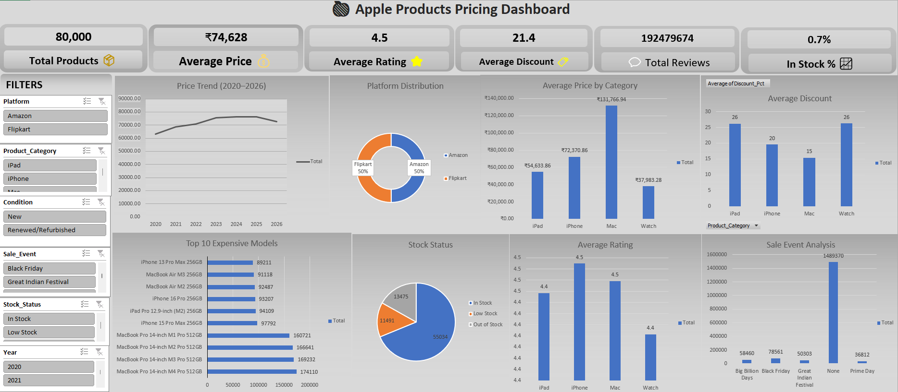

# 🍎 Apple Products Pricing Dashboard

## 📌 Project Overview

This project is an interactive Microsoft Excel dashboard that analyzes Apple product pricing trends from 2020–2026.

The dashboard provides insights into product pricing, discounts, ratings, stock availability, and platform distribution using Pivot Tables, Pivot Charts, KPI Cards, and Slicers.

---

## 📷 Dashboard Preview

---

## 📊 Dashboard Features

- KPI Cards
- Interactive Slicers
- Pivot Tables
- Pivot Charts
- Dynamic Dashboard
- Apple-inspired Theme

---

## 📈 Key KPIs

- Total Products
- Average Price
- Average Rating
- Average Discount
- Total Reviews
- In Stock Percentage

---

## 📊 Visualizations

- Price Trend (2020–2026)
- Platform Distribution
- Average Price by Category
- Average Discount
- Top 10 Expensive Models
- Stock Status
- Average Rating
- Sale Event Analysis

---

## 💡 Key Insights

- Mac products have the highest average selling price.
- iPhone has the highest average customer rating.
- iPad and Watch receive the largest average discounts.
- Most products are currently in stock.
- Product prices increased until 2024–2025 before a slight decline in 2026.

---

## 🛠 Tools Used

- Microsoft Excel 2019
- Pivot Tables
- Pivot Charts
- Slicers
- Dashboard Design
- Data Cleaning

---

## 📂 Files

- Apple_Products_Pricing_Dashboard.xlsx
- dashboard.png
- apple_products_pricing_2020_2026.csv

---

## 👨‍💻 Author ##

## Syed Minhaj Hussain ##
Aspiring Data Analyst

